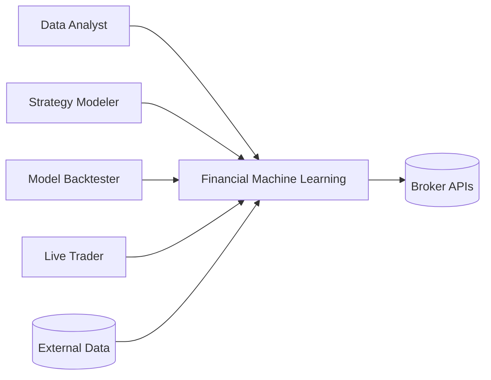
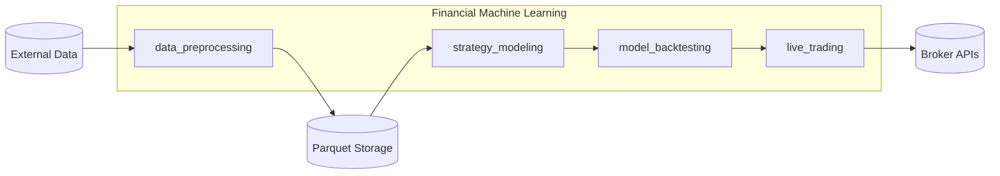
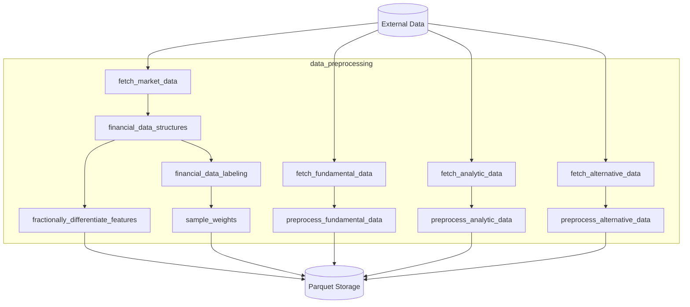
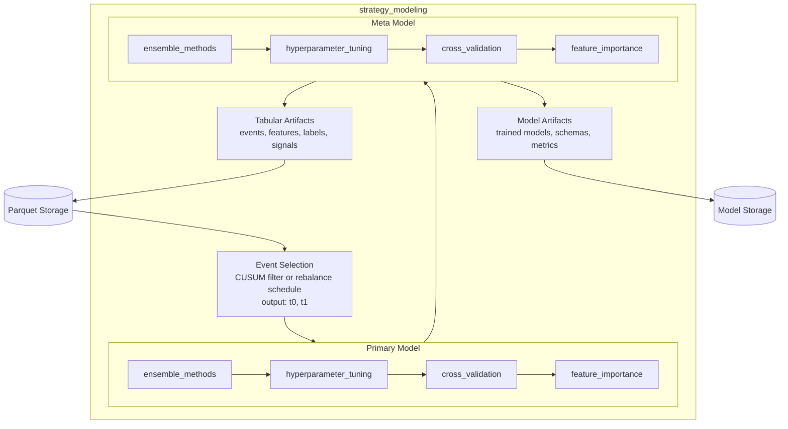
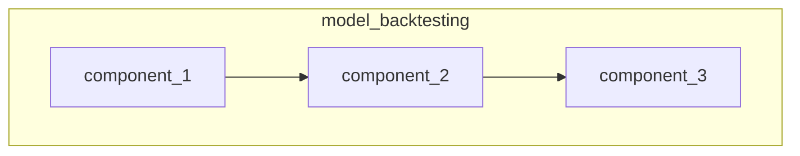
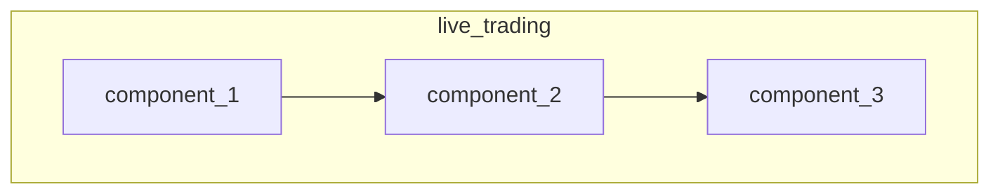

# System Architecture

## 1. Technology Stack

| Category             | Technology       |
|----------------------|------------------|
| Language             | Python           |
| Research Environment | Jupyter Notebook |
| Data Source          | Finnhub          |
| Data Storage         | Parquet          |
| Execution            | Kraken           |
| Documentation        | MkDocs           |

## 2. Architecture Diagrams

### 2.1 Context Diagram

### 2.2 Container Diagram

### 2.3 Component Diagram

#### 2.3.1 data preprocessing

#### 2.3.2 strategy modeling

#### 2.3.3 model backtesting

#### 2.3.4 live trading

