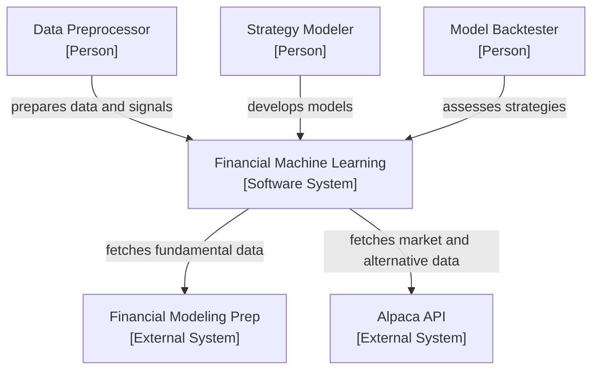
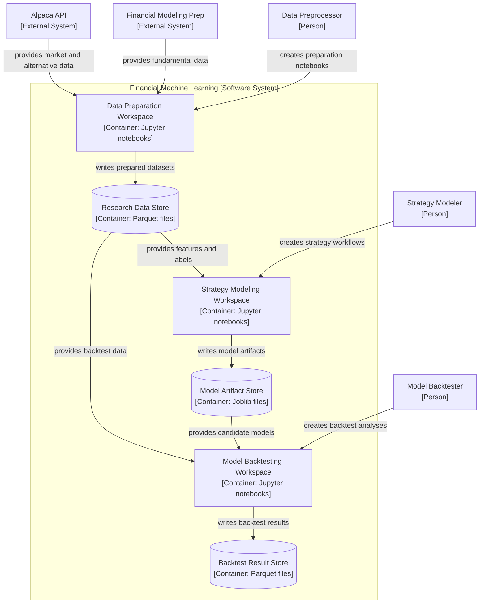
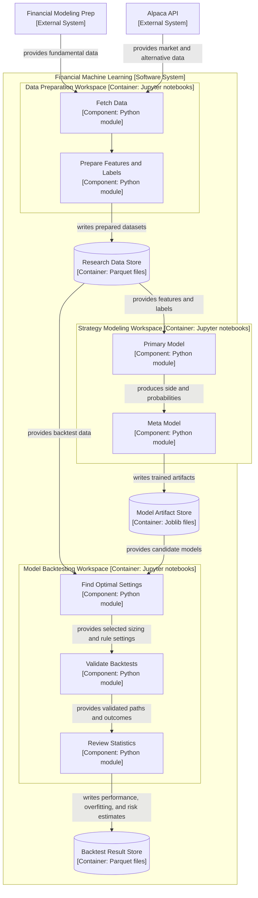

# System Architecture

## 1. Architecture Overview

### 1.1 Technology Stack

| Category                 | Technology                                                  |
|--------------------------|-------------------------------------------------------------|
| Language                 | Python 3.11                                                 |
| Database                 | Parquet                                                     |
| Communication            | REST                                                        |
| Data Science             | Pandas, NumPy, SciPy, scikit-learn, statsmodels, Matplotlib, transformers, PyTorch |
| External Service Clients | financetoolkit, alpaca-py                                    |
| Documentation            | MkDocs                                                      |
| Logging                  | loguru                                                      |
| Testing                  | pytest                                                      |
| CI/CD                    | GitHub Actions                                              |

## 2. Architecture Diagrams

### 2.1 Context Diagram

```mermaid
flowchart TD
    dp["Data Preprocessor<br/>[Person]"]
    sm["Strategy Modeler<br/>[Person]"]
    mb["Model Backtester<br/>[Person]"]
    fmp["Financial Modeling Prep<br/>[External System]"]
    alpaca["Alpaca API<br/>[External System]"]
    system["Financial Machine Learning<br/>[Software System]"]
    dp -->|" prepares data and signals "| system
    sm -->|" develops models "| system
    mb -->|" assesses strategies "| system
    system -->|" fetches fundamental data "| fmp
    system -->|" fetches market and alternative data "| alpaca
```

### 2.2 Container Diagram

```mermaid
flowchart TD
    dp_user["Data Preprocessor<br/>[Person]"]
    sm_user["Strategy Modeler<br/>[Person]"]
    mb_user["Model Backtester<br/>[Person]"]
    fmp["Financial Modeling Prep<br/>[External System]"]
    alpaca["Alpaca API<br/>[External System]"]

    subgraph system["Financial Machine Learning [Software System]"]
        prep_workspace["Data Preparation Workspace<br/>[Container: Jupyter notebooks]"]
        data_store[("Research Data Store<br/>[Container: Parquet files]")]
        strategy_workspace["Strategy Modeling Workspace<br/>[Container: Jupyter notebooks]"]
        model_store[("Model Artifact Store<br/>[Container: Joblib files]")]
        backtest_workspace["Model Backtesting Workspace<br/>[Container: Jupyter notebooks]"]
        result_store[("Backtest Result Store<br/>[Container: Parquet files]")]
    end

    dp_user -->|" creates preparation notebooks "| prep_workspace
    sm_user -->|" creates strategy workflows "| strategy_workspace
    mb_user -->|" creates backtest analyses "| backtest_workspace
    fmp -->|" provides fundamental data "| prep_workspace
    alpaca -->|" provides market and alternative data "| prep_workspace
    prep_workspace -->|" writes prepared datasets "| data_store
    data_store -->|" provides features and labels "| strategy_workspace
    strategy_workspace -->|" writes model artifacts "| model_store
    data_store -->|" provides backtest data "| backtest_workspace
    model_store -->|" provides candidate models "| backtest_workspace
    backtest_workspace -->|" writes backtest results "| result_store
```

### 2.3 Component Diagram

```mermaid
flowchart TD
    fmp["Financial Modeling Prep<br/>[External System]"]
    alpaca["Alpaca API<br/>[External System]"]

    subgraph system["Financial Machine Learning [Software System]"]
        data_store[("Research Data Store<br/>[Container: Parquet files]")]
        model_store[("Model Artifact Store<br/>[Container: Joblib files]")]
        result_store[("Backtest Result Store<br/>[Container: Parquet files]")]

        subgraph prep_workspace["Data Preparation Workspace [Container: Jupyter notebooks]"]
            fetch_data["Fetch Data<br/>[Component: Python module]"]
            prepare_data["Prepare Features and Labels<br/>[Component: Python module]"]
        end

        subgraph strategy_workspace["Strategy Modeling Workspace [Container: Jupyter notebooks]"]
            primary_model["Primary Model<br/>[Component: Python module]"]
            meta_model["Meta Model<br/>[Component: Python module]"]
        end

        subgraph backtest_workspace["Model Backtesting Workspace [Container: Jupyter notebooks]"]
            find_settings["Find Optimal Settings<br/>[Component: Python module]"]
            validate_backtests["Validate Backtests<br/>[Component: Python module]"]
            review_statistics["Review Statistics<br/>[Component: Python module]"]
        end

    end

    fmp -->|" provides fundamental data "| fetch_data
    alpaca -->|" provides market and alternative data "| fetch_data
    fetch_data --> prepare_data
    prepare_data -->|" writes prepared datasets "| data_store
    data_store -->|" provides features and labels "| primary_model
    primary_model -->|" produces side and probabilities "| meta_model
    meta_model -->|" writes trained artifacts "| model_store
    data_store -->|" provides backtest data "| find_settings
    model_store -->|" provides candidate models "| find_settings
    find_settings -->|" provides selected sizing and rule settings "| validate_backtests
    validate_backtests -->|" provides validated paths and outcomes "| review_statistics
    review_statistics -->|" writes performance, overfitting, and risk estimates "| result_store
```
