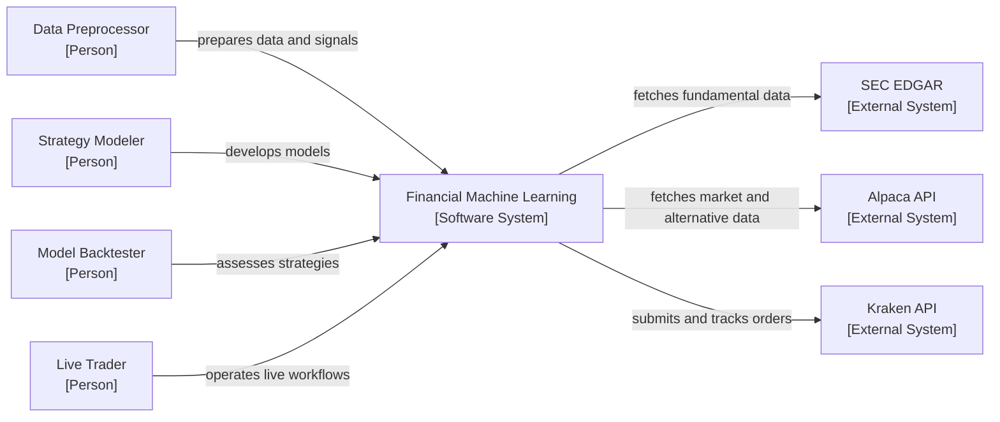
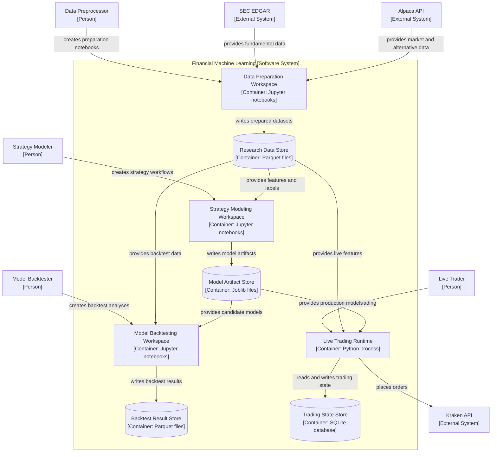
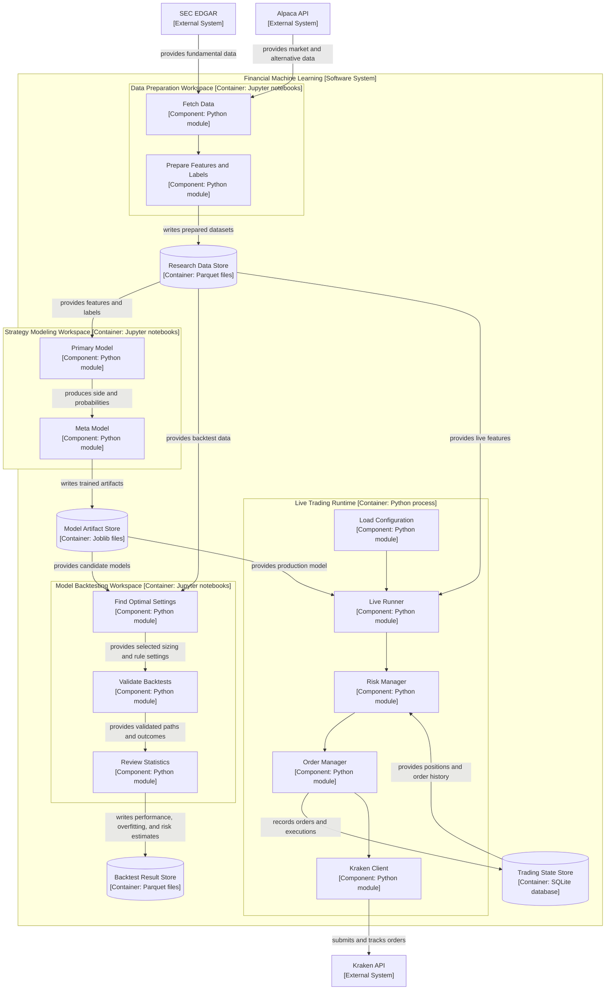

# System Architecture

## 1. Architecture Overview

### 1.1 Technology Stack

| Category             | Technology                  |
|----------------------|-----------------------------|
| Language             | Python 3.11                 |
| Research Environment | Jupyter Notebook            |
| Data Provider        | SEC EDGAR, Alpaca, Benzinga |
| Data Storage         | Parquet, SQLite             |
| Execution Platform   | Kraken                      |
| Documentation Tool   | mkdocs                      |
| Logging Tool         | loguru                      |
| Testing Tool         | pytest                      |

## 2. Architecture Diagrams

### 2.1 Context Diagram

```mermaid
flowchart LR
    dp["Data Preprocessor<br/>[Person]"]
    sm["Strategy Modeler<br/>[Person]"]
    mb["Model Backtester<br/>[Person]"]
    lt["Live Trader<br/>[Person]"]
    sec_edgar["SEC EDGAR<br/>[External System]"]
    alpaca["Alpaca API<br/>[External System]"]
    kraken["Kraken API<br/>[External System]"]
    system["Financial Machine Learning<br/>[Software System]"]
    dp -->|" prepares data and signals "| system
    sm -->|" develops models "| system
    mb -->|" assesses strategies "| system
    lt -->|" operates live workflows "| system
    system -->|" fetches fundamental data "| sec_edgar
    system -->|" fetches market and alternative data "| alpaca
    system -->|" submits and tracks orders "| kraken
```

### 2.2 Container Diagram

```mermaid
flowchart TD
    dp_user["Data Preprocessor<br/>[Person]"]
    sm_user["Strategy Modeler<br/>[Person]"]
    mb_user["Model Backtester<br/>[Person]"]
    trader["Live Trader<br/>[Person]"]
    sec_edgar["SEC EDGAR<br/>[External System]"]
    alpaca["Alpaca API<br/>[External System]"]
    kraken["Kraken API<br/>[External System]"]

    subgraph system["Financial Machine Learning [Software System]"]
        prep_workspace["Data Preparation Workspace<br/>[Container: Jupyter notebooks]"]
        data_store[("Research Data Store<br/>[Container: Parquet files]")]
        strategy_workspace["Strategy Modeling Workspace<br/>[Container: Jupyter notebooks]"]
        model_store[("Model Artifact Store<br/>[Container: Joblib files]")]
        backtest_workspace["Model Backtesting Workspace<br/>[Container: Jupyter notebooks]"]
        result_store[("Backtest Result Store<br/>[Container: Parquet files]")]
        live_workspace["Live Trading Runtime<br/>[Container: Python process]"]
        trading_state_store[("Trading State Store<br/>[Container: SQLite database]")]
    end

    dp_user -->|" creates preparation notebooks "| prep_workspace
    sm_user -->|" creates strategy workflows "| strategy_workspace
    mb_user -->|" creates backtest analyses "| backtest_workspace
    trader -->|" operates live trading "| live_workspace
    sec_edgar -->|" provides fundamental data "| prep_workspace
    alpaca -->|" provides market and alternative data "| prep_workspace
    prep_workspace -->|" writes prepared datasets "| data_store
    data_store -->|" provides features and labels "| strategy_workspace
    strategy_workspace -->|" writes model artifacts "| model_store
    data_store -->|" provides backtest data "| backtest_workspace
    model_store -->|" provides candidate models "| backtest_workspace
    backtest_workspace -->|" writes backtest results "| result_store
    data_store -->|" provides live features "| live_workspace
    model_store -->|" provides production models "| live_workspace
    live_workspace -->|" reads and writes trading state "| trading_state_store
    live_workspace -->|" places orders "| kraken
```

### 2.3 Component Diagram

```mermaid
flowchart TD
    sec_edgar["SEC EDGAR<br/>[External System]"]
    alpaca["Alpaca API<br/>[External System]"]
    kraken["Kraken API<br/>[External System]"]

    subgraph system["Financial Machine Learning [Software System]"]
        data_store[("Research Data Store<br/>[Container: Parquet files]")]
        model_store[("Model Artifact Store<br/>[Container: Joblib files]")]
        result_store[("Backtest Result Store<br/>[Container: Parquet files]")]
        trading_state_store[("Trading State Store<br/>[Container: SQLite database]")]

        subgraph prep_workspace["Data Preparation Workspace [Container: Jupyter notebooks]"]
            fetch_data["Fetch Data<br/>[Component: Python module]"]
            prepare_data["Prepare Features and Labels<br/>[Component: Python module]"]
        end

        subgraph strategy_workspace["Strategy Modeling Workspace [Container: Jupyter notebooks]"]
            primary_model["Primary Model<br/>[Component: Python module]"]
            meta_model["Meta Model<br/>[Component: Python module]"]
        end

        subgraph backtest_workspace["Model Backtesting Workspace [Container: Jupyter notebooks]"]
            find_settings["Find Optimal Settings<br/>[Component: Python module]"]
            validate_backtests["Validate Backtests<br/>[Component: Python module]"]
            review_statistics["Review Statistics<br/>[Component: Python module]"]
        end

        subgraph live_workspace["Live Trading Runtime [Container: Python process]"]
            load_config["Load Configuration<br/>[Component: Python module]"]
            live_runner["Live Runner<br/>[Component: Python module]"]
            check_risk["Risk Manager<br/>[Component: Python module]"]
            manage_orders["Order Manager<br/>[Component: Python module]"]
            kraken_client["Kraken Client<br/>[Component: Python module]"]
        end
    end

    sec_edgar -->|" provides fundamental data "| fetch_data
    alpaca -->|" provides market and alternative data "| fetch_data
    fetch_data --> prepare_data
    prepare_data -->|" writes prepared datasets "| data_store
    data_store -->|" provides features and labels "| primary_model
    primary_model -->|" produces side and probabilities "| meta_model
    meta_model -->|" writes trained artifacts "| model_store
    data_store -->|" provides backtest data "| find_settings
    model_store -->|" provides candidate models "| find_settings
    find_settings -->|" provides selected sizing and rule settings "| validate_backtests
    validate_backtests -->|" provides validated paths and outcomes "| review_statistics
    review_statistics -->|" writes performance, overfitting, and risk estimates "| result_store
    data_store -->|" provides live features "| live_runner
    model_store -->|" provides production model "| live_runner
    trading_state_store -->|" provides positions and order history "| check_risk
    load_config --> live_runner
    live_runner --> check_risk
    check_risk --> manage_orders
    manage_orders -->|" records orders and executions "| trading_state_store
    manage_orders --> kraken_client
    kraken_client -->|" submits and tracks orders "| kraken
```
